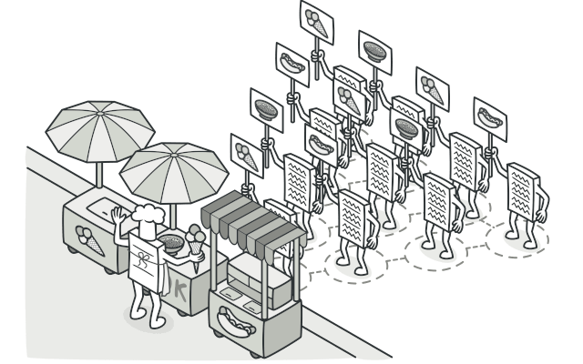
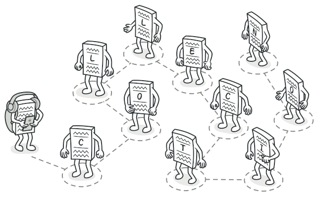

# Design-patterns

- What is Design Pattern?
  Design patterns are typical solutions to commonly occurring problems in software design. They are like pre-made blueprints that you can customize to solve a recurring design problem in your code

## The Catalog of Design Patterns

- Creational patterns:
    These patterns provide various object creation mechanisms, which increase flexibility and reuse of existing code

- Structural patterns
    These patterns explain how to assemble objects and classes into larger structures while keeping these structures flexible and efficient.

- Behavioral patterns
    These patterns are concerned with algorithms and the assignment of responsibilities between objects.

## Creational patterns

1- Factory pattern
    - is a creational design pattern that provides an interface for creating objects in a superclass, but allows subclasses to alter the type of objects that will be created.

**Check**

[Link](https://refactoring.guru/design-patterns/factory-method)

---

2- Abstract Factory
    - is a creational design pattern that lets you produce families of related objects without specifying their concrete classes.

**Check**

[Link](https://refactoring.guru/design-patterns/abstract-factory)

---

3- Singleton
    - is a creational design pattern that lets you ensure that a class has only one instance, while providing a global access point to this instance.

**Check**

[Link](https://refactoring.guru/design-patterns/singleton)

---

4- Builder
    - is a creational design pattern that lets you construct complex objects step by step. The pattern allows you to produce different types and representations of an object using the same construction code.

**Check**

[Link](https://refactoring.guru/design-patterns/builder)

---

5- Prototype
    - is a creational design pattern that lets you copy existing objects without making your code dependent on their classes.

**Check**

[Link](https://refactoring.guru/design-patterns/prototype)

---

## Structural Patterns

1- Decorator
    - is a structural design pattern that lets you attach new behaviors to objects by placing these objects inside special wrapper objects that contain the behaviors.

**Check**

[Link](https://refactoring.guru/design-patterns/decorator)

---

2- Proxy
    -  is a structural design pattern that lets you provide a substitute or placeholder for another object. A proxy controls access to the original object, allowing you to perform something either before or after the request gets through to the original object.

**Check**

[Link](https://refactoring.guru/design-patterns/proxy)

---

3- Adapter
    - is a structural design pattern that allows objects with incompatible interfaces to collaborate.

**Check**

[Link](https://refactoring.guru/design-patterns/adapter)

---

4- Composite
    - is a structural design pattern that lets you compose objects into tree structures and then work with these structures as if they were individual objects.

**Check**

[Link](https://refactoring.guru/design-patterns/composite)

---

5- Bridge
    - is a structural design pattern that lets you split a large class or a set of closely related classes into two separate hierarchies—abstraction and implementation—which can be developed independently of each other.

**Check**

[Link](https://refactoring.guru/design-patterns/bridge)

---

## Behavioral Patterns

1- Observer
    - is a behavioral design pattern that lets you define a subscription mechanism to notify multiple objects about any events that happen to the object they’re observing..

**Check**

[Link](https://refactoring.guru/design-patterns/observer)

---

2- Visitor
    - is a behavioral design pattern that lets you separate algorithms from the objects on which they operate.

**Check**

[Link](https://refactoring.guru/design-patterns/visitor)

---

3- Iterator
    - is a behavioral design pattern that lets you traverse elements of a collection without exposing its underlying representation (list, stack, tree, etc.)

**Check**

[Link](https://refactoring.guru/design-patterns/iterator)

---

4- Strategy
    - is a behavioral design pattern that lets you define a family of algorithms, put each of them into a separate class, and make their objects interchangeable.

**Check**

[Link](https://refactoring.guru/design-patterns/strategy)

---

5- Chain of Responsibility
    - is a behavioral design pattern that lets you pass requests along a chain of handlers. Upon receiving a request, each handler decides either to process the request or to pass it to the next handler in the chain.

**Check**

[Link](https://refactoring.guru/design-patterns/chain-of-responsibility)

---
